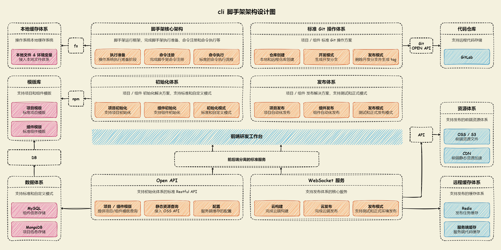
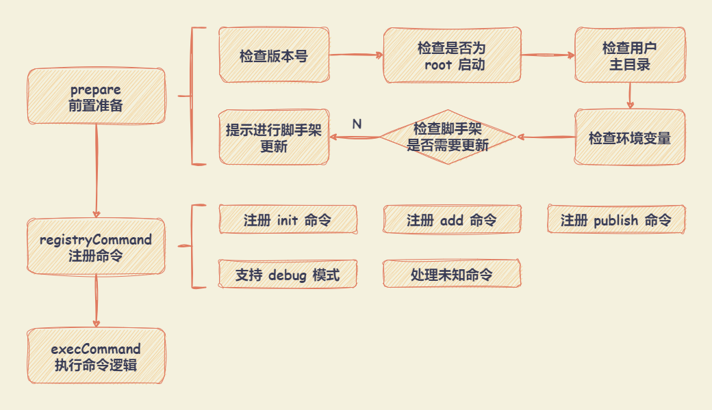

# lego-cli

## lego-cli 脚手架架构图

### 脚手架核心架构

#### core-cli 模块

- 进行前置准备工作，如：检查版本号、检查是否为 root 启动（避免使用 root 启动）、检查用户主目录、检查是否是最新版本、检查是否是合法命令等。
- 通过 `commander` 库将参数解析为选项和命令参数。
  - `lego-cli`
  - `lego-cli init [projectName]`
  - `lego-cli add [templateName]`
  - `lego-cli publish`

#### core-exec 模块

用于动态执行命令库，通过 `child_process` 模块执行。

#### commands-init 模块

#### commands-add 模块

#### commands-publish 模块
